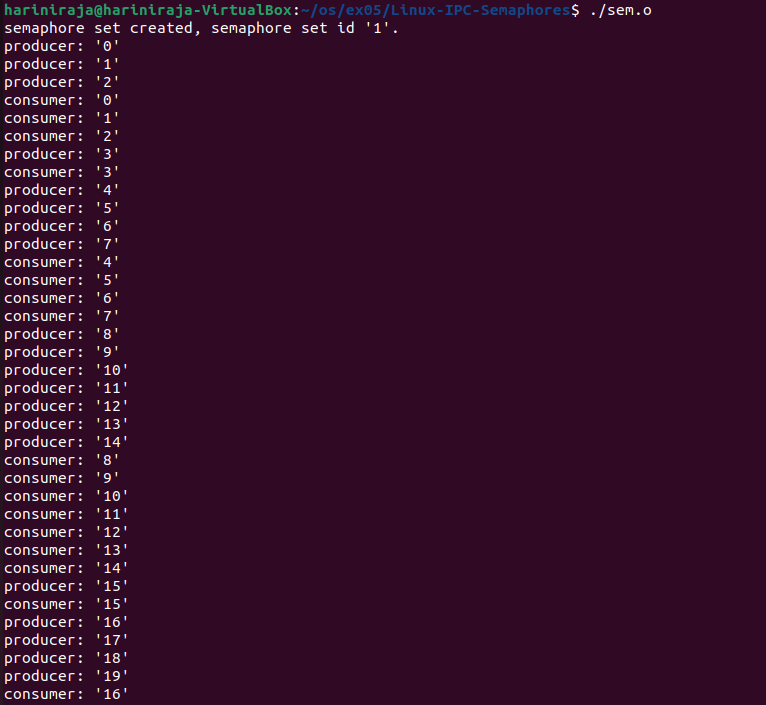

# EX05 Linux-IPC-Semaphores

# AIM:
To Write a C program that implements a producer-consumer system with two processes using Semaphores.

# DESIGN STEPS:

### Step 1:

Navigate to any Linux environment installed on the system or installed inside a virtual environment like virtual box/vmware or online linux JSLinux (https://bellard.org/jslinux/vm.html?url=alpine-x86.cfg&mem=192) or docker.

### Step 2:

Write the C Program using Linux Process API - Sempahores

### Step 3:

Execute the C Program for the desired output. 

# PROGRAM:

## Write a C program that implements a producer-consumer system with two processes using Semaphores.
```
#include <stdio.h>
#include <stdlib.h>
#include <unistd.h>
#include <time.h>
#include <sys/types.h>
#include <sys/ipc.h>
#include <sys/sem.h>

#define NUM_LOOPS 20

#if defined(__GNU_LIBRARY__) && !defined(_SEM_SEMUN_UNDEFINED)
#else
union semun {
    int val;
    struct semid_ds *buf;
    unsigned short int *array;
    struct seminfo *__buf;
};
#endif

int main(int argc, char* argv[]) {
    int sem_set_id;
    union semun sem_val;
    int child_pid;
    int i;
    struct sembuf sem_op;
    int rc;
    struct timespec delay;

    sem_set_id = semget(IPC_PRIVATE, 1, 0600);
    if (sem_set_id == -1) {
        perror("main: semget");
        exit(1);
    }

    printf("semaphore set created, semaphore set id '%d'.\n", sem_set_id);

    sem_val.val = 0;
    rc = semctl(sem_set_id, 0, SETVAL, sem_val);

    child_pid = fork();
    switch (child_pid) {
        case -1:
            perror("fork");
            exit(1);
        case 0:
            for (i = 0; i < NUM_LOOPS; i++) {
                sem_op.sem_num = 0;
                sem_op.sem_op = -1;
                sem_op.sem_flg = 0;
                semop(sem_set_id, &sem_op, 1);
                printf("consumer: '%d'\n", i);
                fflush(stdout);
            }
            exit(0); // Terminate child process explicitly
        default:
            for (i = 0; i < NUM_LOOPS; i++) {
                printf("producer: '%d'\n", i);
                fflush(stdout);
                sem_op.sem_num = 0;
                sem_op.sem_op = 1;
                sem_op.sem_flg = 0;
                semop(sem_set_id, &sem_op, 1);
                if (rand() > 3 * (RAND_MAX / 4)) {
                    delay.tv_sec = 0;
                    delay.tv_nsec = 10;
                    nanosleep(&delay, NULL);
                }
            }
            // Remove the semaphore set outside of the loop
            if (NUM_LOOPS >= 10) {
                semctl(sem_set_id, 0, IPC_RMID, sem_val);
            }
            break;
    }
    return 0;
}
```
## OUTPUT
$ gcc -o sem.o sem.c


$ ./sem.o 


$ ipcs


# RESULT:
The program is executed successfully.
